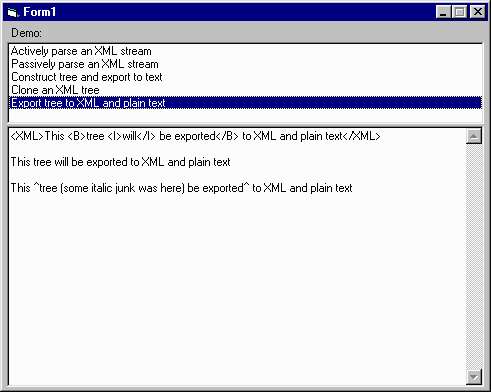



## XML Engine \(classes and demo\)

### Description

The XML Engine is a set of classes designed to make it easy for your programs to parse and construct XML.

The parser can be used either to automatically construct an easy-to-use data structure (like I.E.'s document object model) or direct your program (through events) to do what it needs to on the fly. This latter mode facilitates work on the data even as the XML is being incrementally received, as from a long file download. This means your program won't have to wait to start work and can avoid memory overruns associated with "passively" parsing huge XML files. This approach could even be used with an endless stream of XML, which would be great for quickly implementing a simple client/server communication protocol (search for my "Socket Controls" package here at PSC).

The XmlElement class, which represents a node in an XML tree, can be used independently of the engine. Your program can easily clone an XML tree, insert new branches anywhere, remove whole branches, and export it to raw XML or plain text (stripped of XML tags). The plain-text export can be given an array telling it what to replace certain tags with, too. An element node can be either a representation of a named tag (e.g., "TABLE") with named attributes or a text block (anything that would appear in-between tags).

A demo program is included with simple demonstrations of a number of basic techniques.

This engine does not deal with every last idiosyncracy of XML and assumes any XML it parses is well-formed. DTD's are not supported (not that they really relevant, here). But the basics of XML are supported. It can even be used as an HTML generator and parser, provided the HTML is XML-formatted (all start tags must have end tags or be single-tag formatted like "&lt;SOMETAG/&gt;").

Unfortunately, there is currently no documentation, but the code is straightforward and easy to read. Further, the demos should provide enough explanation for how to use the engine.

Your comments and votes are welcome.
 
### More Info
 

             |
---                |---
**Submitted On**   |2000-06-28 09:14:02
**By**             |[James Vincent Carnicelli](https://github.com/Planet-Source-Code/PSCIndex/blob/master/ByAuthor/james-vincent-carnicelli.md)
**Level**          |Intermediate
**User Rating**    |4.4 (40 globes from 9 users)
**Compatibility**  |VB 3\.0, VB 4\.0 \(16\-bit\), VB 4\.0 \(32\-bit\), VB 5\.0, VB 6\.0, VB Script, ASP \(Active Server Pages\) 
**Category**       |[Data Structures](https://github.com/Planet-Source-Code/PSCIndex/blob/master/ByCategory/data-structures__1-33.md)
**World**          |[Visual Basic](https://github.com/Planet-Source-Code/PSCIndex/blob/master/ByWorld/visual-basic.md)
**Archive File**   |[CODE\_UPLOAD72426282000\.zip](https://github.com/Planet-Source-Code/james-vincent-carnicelli-xml-engine-classes-and-demo__1-9336/archive/master.zip)

